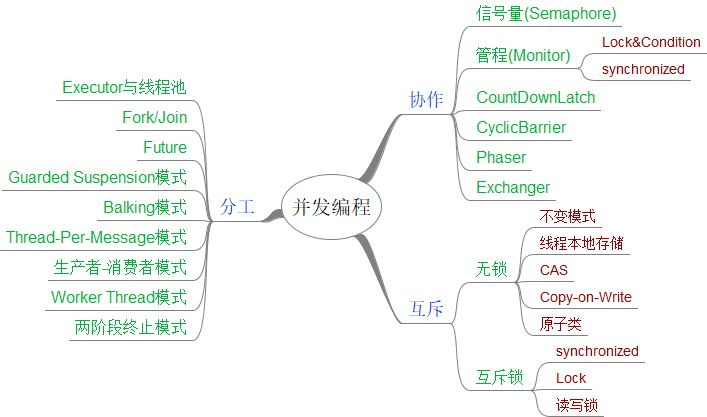

<a href="../README.md">返回README</a>

<!-- TOC -->

- [如何才能学好并发编程](#如何才能学好并发编程)
    - [跳出来看全景](#跳出来看全景)
        - [分工](#分工)
        - [同步](#同步)
        - [互斥](#互斥)
    - [钻进去，看本质](#钻进去看本质)

<!-- /TOC -->

# 如何才能学好并发编程

## 跳出来看全景  

并发编程的三个核心 分工、同步、互斥

### 分工

<pre>
类似于要完成一项任务，项目经理要拆分任务，安排合适的成员去完成。
SDK包里的Executor、Fork/Join、Future本质上就是一种分工方法。
除此之外，并发编程还存在一些设计模式，比如生产者-消费者模式、Thread-Per-Message、
Worker Thread模式等都和分工相关。
</pre>

### 同步

<pre>
分工好了之后就是执行阶段。在项目执行过程中，任务之间是有依赖的，一个任务结束后，依赖他的后续任务就可以开工了，后续任务怎么知道可以开工了呢？这个就是靠沟通协作了，这是一项非常重要的工作了。  
在并发编程领域中的同步，主要指的就是线程间的协作，本质和现实生活中的协作没有区别，不过是 一个县城执行完了一个任务，如何通知执行后续任务的线程开工 而已。  
协作一般和分工也是紧密相关的。并发包中的Executor、Fork/Join、Future本质上是分工方法，但同时也能解决线程之间协作的问题。例如，使用Future可以发起一个异步调用，当主线程通过get方法获取结果时，主线程就会等待，当异步执行的结果返回时，get方法就自动返回了。主线程和异步线程之前的协作，Future工具类已经帮我们解决了。除此之外，Java SDK提供的countDownLatch、CyclicBarrier、Phaser、Exchanger也都是用来解决线程协作问题的。  
工作中遇到的线程之间的问题，一般可以归类为:当某个条件不满足时，其他线程需要等待，当某个条件满足时，线程需要被唤醒。  
在Java中解决协作问题的核心技术是管程。管程是解决并发协作的万能钥匙  
所以说这部分的学习主要是学习管程，要深入理解管程的概念和原理。同时要理解sdk对应的并发工具类的使用场景。用好他们可以妥妥的提高你的工作效率。
</pre>

### 互斥  

```el
分工和协作主要强调的是性能，但并发编程中还要讲究正确性，用专业术语说就是线程安全。并发编程中，当多个线程同时访问一个贡献变量时，结果是不确定的。解决线程安全的核心理念就是互斥  
所谓互斥，就是在同一时刻，只允许一个线程访问共享变量  
实现互斥的核心技术就是锁，Java语言中的synchronized、SDK中的Lock都能解决互斥的问题，虽说解决了安全性问题，但同时也带来了其他的性能问题，那如何保证解决互斥有尽量提高性能呢？可以分场景优化，Java SDK中提供的ReadWriteLock、StampedLock就可以优化读多写少的场景，还有无锁的设计模式，CAS，比如原子类。  
除此之外，还有一些其他的方案，原理是不共享变量或者变量只允许读。这方面，Java提供了Thread Local和final关键字，还有一种Copy-on-write的模式。
```  



## 钻进去，看本质

跳出来可建立体系，但是具体的某个问题必须钻进去，深入理解，找到他们的本质