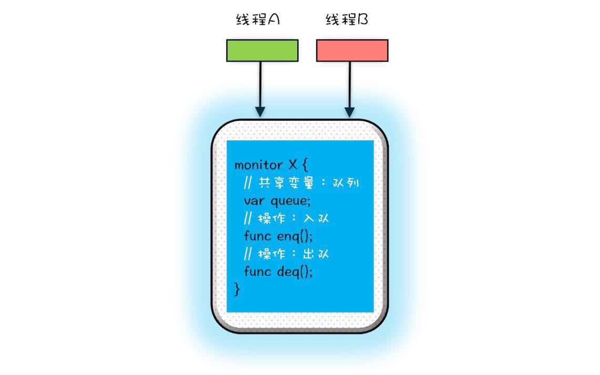
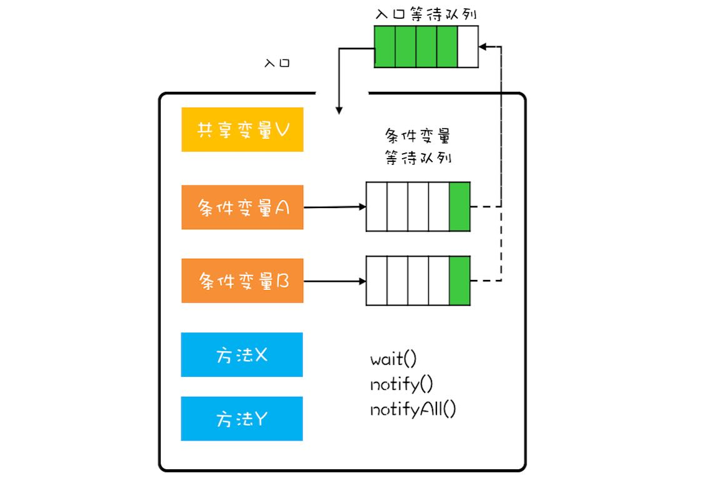

# 概览

管程是解决编发问题的有力武器，在1.5之前的并发编程就是基于管程的，1.5之后也是基于管程处理的。当前C/C++、C#都是基于管程的,可以感觉管程是处理并发的万能钥匙

## 1 什么是管程

<pre>
synchronized、wait、notify以及notifyall都是基于管程的。
管程和信号量差不多是等价的，所谓等价就是管程能够实现信号量，信号量也能实现管程，但是管程更容易实现
管程就是Monitor，也就是经常说起的监视器
所谓管程就是管理共享变量以及对共享变量的操作过程，让他们支持并发。也就是说这个类是线程安全的
</pre>

## 2 MESA模型

在管程发展的历程中，先后出现了三种不同的管程模型，分别是Hasen模型、Hoare模型和MESA模型。现在应用最广泛的就是MESA模型

<pre>
在并发编程领域，有两大核心问题: 互斥(同一时刻只允许一个线程访问共享资源)和同步(线程之间如何通信、协作)
</pre>

管程实现互斥: 将共享变量及其对共享变量的操作统一封装起来。线程操作共享变量只能通过管程提供的enq()、deq()方法实现，那么管程的方法来保证互斥。

MESA模型的示意图如下:

## 3 wait()的正确姿势

wait()方法需要在while()循环中调用，这是MEGA管程持有的

<pre>
while(条件不满足){
    wait();
}
</pre>

## 4 notify()何时可以使用

如果满足以下三个条件，那么可以选择使用notify()操作

* 所有等待线程拥有相同的等待条件
* 所有等待线程被唤醒后，执行相同的操作
* 只需要唤醒一个线程

