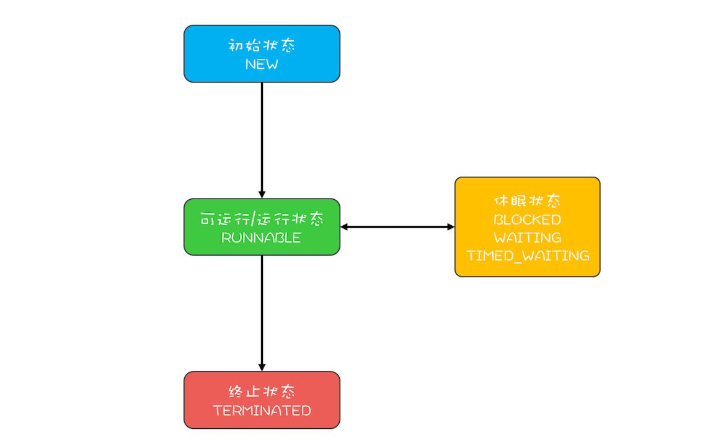

# 概览

在Java领域里面，实现并发程序的主要手段就是多线程，简单说多线程直接对应着操作系统的线程

## 1 通用的线程生命周期

通用的生命周期分为五个状态:

### 1.1 初始状态

线程已经被创建，但是还不允许分配CPU时间执行。这里的被创建是指的在编程语言中被创建，但是操作系统中并没有

### 1.2 可运行状态

线程可以分配CPU执行。在这种状态下操作系统真正的创建了线程

### 1.3 运行状态

当CPU有空闲周期时，某个线程将被分配到CPU时间，这样的线程就转换成了运行状态

### 1.4 休眠状态

运行状态的线程如果调用一个阻塞的API或者等待某个时间，那么线程的状态就会转换到休眠状态，同时释放CPU使用权。休眠状态的线程永远得不到CPU时间。当等待的事件出现了，线程就会从休眠状态转换到可运行状态

### 1.5 终止状态

线程执行出现异常或运行完成那么久会进入到终止状态，进入到终止状态就意味着线程的生命周期结束了

## 2 Java中的六种状态

* New(初始化状态)
* RUNNABLE(可运行/运行状态)
* BLOCKED(阻塞状态)
* WAITING(无时限等待)
* TIMED_WAITING(有时限等待)
* TERMINATED(终止状态)

其中BLOCKED、WAITING和TIMED_WAITING三种状态永远没有CPU的使用权，那么JAVA线程的生命周期可以简化为下图:

### 2.1 RUNNABLE和BLOCKED的状态转换

只有一种情况会出现，就是线程等待synchronized的隐式锁。当获取到隐式锁时状态又从BLOCKED转换为RUNNABLE状态

### 2.2 RUNNABLE和WAITING的状态转换

有三种场景会导致这样的状态转换

* 获得synchronized隐式锁的线程调用无参数的Object.wait()方法
* 调用无参数的Thread.join()方法，当被Join的线程执行完成之后，主线程状态又从WAITING转换为RUNNABLE
* 调用LockSupport.park()方法，当调用LockSupport.unpark(Thread thread)时状态从WAITING转换为RUNNABLE

### 2.3 RUNNABLE与TIMED_WAITING的状态转换

有五种场景会导致这样的状态转换:

* 调用带超时参数的sleep(long timeout)方法
* 获得synchronized隐式锁的线程调用带超时参数的Object.wait(long timeout)方法
* 调用带有超时参数的Thread.join(long timeout)方法
* 调用带超时参数的LockSupport.parkNanos(long timeout)方法
* 调用带超时参数的LockSupport.parkUntil(long timeout)方法

### 2.4 从New到RUNNABLE状态

调用线程对象的start()方法

### 2.5 从RUNNABLE到TERMINATED状态

当线程执行完run()方法后或抛出异常都会转换到TERMINATED状态，如果要强制终止线程，正确的姿势是调用interrupt()方法