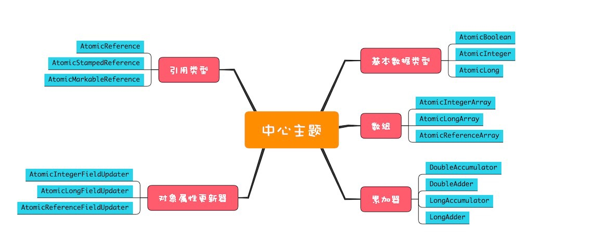

# 概览

本节介绍原子类的实现思想以及使用

## 1 原子类概览

```
Java SDK并发包中提供的原子类内容很丰富，可以分成五类
1. 原子化的基本数据类型
2. 原子化的对象引用类型
3. 原子化数组
4. 原子化对象属性更新器
5. 原子化的累加器
```



### 1.1 原子化的基本数据类型

相关实现包括: AtomicBoolean、AtomicInteger和AtomicLong

### 1.2 原子化的对象引用类型

```
相关实现包括: AtomicReference、AtomicStampedReference和AtomicMarkableReference，利用他们可以实现对对象引用的原子化更新
AtomicStampedReference和AtomicMarkableReference可以有效解决ABA问题，解决ABA问题的思路就是添加版本号信息
```

### 1.3 原子化数组

* 相关实现有AtomicIntegerArray、AtomicLongArray和AtomicReferenceArray，利用这些原子类可以原子化的更新数组里面的每一个元素

### 1.4 原子化对象属性更新器

相关实现有AtomicIntegerFieldUpdater、AtomicLongFieldUpdater和AtomicReferenceFieldUpdater,利用他们可以原子化更新对象的属性

### 1.5 原子化的累加器

相关实现有DoubleAccumulator、DoubleAdder、LongAccumulator和LongAdder

## 2 总结

```
无锁方案相对于互斥锁方案，优点非常多:
1. 性能好
2. 不会死锁
3. 
```