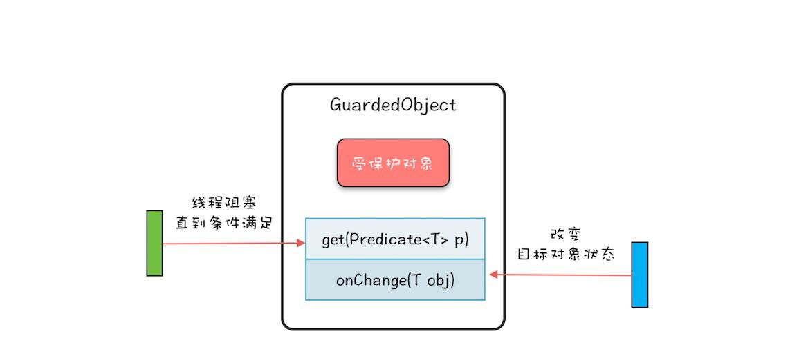

# 概览

Guarded Suspension模式是处理线程需要等待某个条件完成的操作  
直译过来就是保护性的暂停某个操作

## 1 Guarded Suspension模式



```
上图就是Guarded Suspension模式的结构图，非常简单，一个对象GuardedObject  
内部有一个成员变量-受保护的对象，以及两个方法，get和onChanged()方法。其中  
Guarded对象就是大厅经理，被保护的对象就是餐厅里面的包间，受保护对象的get就是
我们的就餐，就餐的前提条件就是包间已经收拾好了，参数p用于描述这个前提条件的；
onChanged方法对应的是服务员把包间收拾好了，通过onChanged()方法可以free一个事件，
而这个事件往往能改变前提条件p的计算结果  

GuardedObject的内部实现非常简单，是管程的一个经典用法。
```


|users|second|loop count||

|samples|avg|min|max|throughput|
|--|--|--|--|--|
|5000|44|18|240|462|
|6000|79|16|545|539|
|6500|121|14|715|560|
|6700|172|18|1085|556|
|6700|154|16|1123|567|
|6800|204|15|1224|547|
|7000|296|18|1495|507|