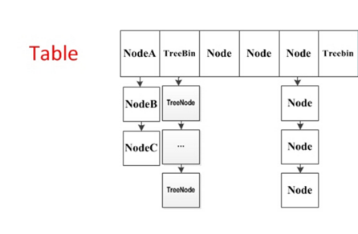

<a href="000.concurrent.md">返回</a>

# ConcurrentHashmap

## 1.ConcurrentHashmap简介

在使用HashMap时在多线程情况下扩容会出现CPU接近100%的情况，因为hashmap并不是线程安全的，通常我们可以使用在java体系中古老的hashtable类，该类基本上所有的方法都采用synchronized进行线程安全的控制，可想而知，在高并发的情况下，每次只有一个线程能够获取对象监视器锁，这样的并发性能的确不令人满意。另外一种方式通过Collections的Map<K,V> synchronizedMap(Map<K,V> m)将hashmap包装成一个线程安全的map。比如SynchronzedMap的put方法源码为：

<pre>
public V put(K key, V value) {
    synchronized (mutex) {return m.put(key, value);}
}
</pre>

实际上SynchronizedMap实现依然是采用synchronized独占式锁进行线程安全的并发控制的。同样，这种方案的性能也是令人不太满意的。针对这种境况，Doug Lea大师不遗余力的为我们创造了一些线程安全的并发容器，让每一个java开发人员倍感幸福。相对于hashmap来说，ConcurrentHashMap就是线程安全的map，其中利用了锁分段的思想提高了并发度。

ConcurrentHashMap在JDK1.6的版本网上资料很多，有兴趣的可以去看看。 JDK 1.6版本关键要素：

1. segment继承了ReentrantLock充当锁的角色，为每一个segment提供了线程安全的保障；
2. segment维护了哈希散列表的若干个桶，每个桶由HashEntry构成的链表。

而到了JDK 1.8的ConcurrentHashMap就有了很大的变化，光是代码量就足足增加了很多。1.8版本舍弃了segment，并且大量使用了synchronized，以及CAS无锁操作以保证ConcurrentHashMap操作的线程安全性。至于为什么不用ReentrantLock而是Synchronzied呢？实际上，synchronzied做了很多的优化，包括偏向锁，轻量级锁，重量级锁，可以依次向上升级锁状态，但不能降级（关于synchronized可以看这篇文章），因此，使用synchronized相较于ReentrantLock的性能会持平甚至在某些情况更优，具体的性能测试可以去网上查阅一些资料。另外，底层数据结构改变为采用数组+链表+红黑树的数据形式。

## 2.关键属性及类

在了解ConcurrentHashMap的具体方法实现前，我们需要系统的来看一下几个关键的地方。
> ConcurrentHashMap的关键属性

1. table volatile Node<K,V>[] table://装载Node的数组，作为ConcurrentHashMap的数据容器，采用懒加载的方式，直到第一次插入数据的时候才会进行初始化操作，数组的大小总是为2的幂次方。
2. nextTable volatile Node<K,V>[] nextTable; //扩容时使用，平时为null，只有在扩容的时候才为非null
3. sizeCtl volatile int sizeCtl; 该属性用来控制table数组的大小，根据是否初始化和是否正在扩容有几种情况： **当值为负数时：**如果为-1表示正在初始化，如果为-N则表示当前正有N-1个线程进行扩容操作； **当值为正数时：**如果当前数组为null的话表示table在初始化过程中，sizeCtl表示为需要新建数组的长度； 若已经初始化了，表示当前数据容器（table数组）可用容量也可以理解成临界值（插入节点数超过了该临界值就需要扩容），具体指为数组的长度n 乘以 加载因子loadFactor； 当值为0时，即数组长度为默认初始值。
4. sun.misc.Unsafe U 在ConcurrentHashMapde的实现中可以看到大量的U.compareAndSwapXXXX的方法去修改ConcurrentHashMap的一些属性。这些方法实际上是利用了CAS算法保证了线程安全性，这是一种乐观策略，假设每一次操作都不会产生冲突，当且仅当冲突发生的时候再去尝试。而CAS操作依赖于现代处理器指令集，通过底层CMPXCHG指令实现。CAS(V,O,N)核心思想为：若当前变量实际值V与期望的旧值O相同，则表明该变量没被其他线程进行修改，因此可以安全的将新值N赋值给变量；若当前变量实际值V与期望的旧值O不相同，则表明该变量已经被其他线程做了处理，此时将新值N赋给变量操作就是不安全的，在进行重试。而在大量的同步组件和并发容器的实现中使用CAS是通过sun.misc.Unsafe类实现的，该类提供了一些可以直接操控内存和线程的底层操作，可以理解为java中的“指针”。该成员变量的获取是在静态代码块中：

<pre>
static {
     try {
         U = sun.misc.Unsafe.getUnsafe();
         .......
     } catch (Exception e) {
         throw new Error(e);
     }
 }
</pre>

> ConcurrentHashMap中关键内部类

1. Node Node类实现了Map.Entry接口，主要存放key-value对，并且具有next域

<pre>
static class Node<K,V> implements Map.Entry<K,V> {
         final int hash;
         final K key;
         volatile V val;
         volatile Node<K,V> next;
 		......
 }
</pre>
另外可以看出很多属性都是用volatile进行修饰的，也就是为了保证内存可见性。

2. TreeNode 树节点，继承于承载数据的Node类。而红黑树的操作是针对TreeBin类的，从该类的注释也可以看出，也就是TreeBin会将TreeNode进行再一次封装

<pre>
 **
  * Nodes for use in TreeBins
  */
 static final class TreeNode<K,V> extends Node<K,V> {
         TreeNode<K,V> parent;  // red-black tree links
         TreeNode<K,V> left;
         TreeNode<K,V> right;
         TreeNode<K,V> prev;    // needed to unlink next upon deletion
         boolean red;
 		......
 }
</pre>

3. TreeBin 这个类并不负责包装用户的key、value信息，而是包装的很多TreeNode节点。实际的ConcurrentHashMap“数组”中，存放的是TreeBin对象，而不是TreeNode对象。

<pre>
 static final class TreeBin<K,V> extends Node<K,V> {
         TreeNode<K,V> root;
         volatile TreeNode<K,V> first;
         volatile Thread waiter;
         volatile int lockState;
         // values for lockState
         static final int WRITER = 1; // set while holding write lock
         static final int WAITER = 2; // set when waiting for write lock
         static final int READER = 4; // increment value for setting read lock
 		......
 }
</pre>

4. ForwardingNode 在扩容时才会出现的特殊节点，其key,value,hash全部为null。并拥有nextTable指针引用新的table数组。

<pre>
 static final class ForwardingNode<K,V> extends Node<K,V> {
     final Node<K,V>[] nextTable;
     ForwardingNode(Node<K,V>[] tab) {
         super(MOVED, null, null, null);
         this.nextTable = tab;
     }
    .....
 }
</pre>

> CAS关键操作

在上面我们提及到在ConcurrentHashMap中会大量使用CAS修改它的属性和一些操作。因此，在理解ConcurrentHashMap的方法前我们需要了解下面几个常用的利用CAS算法来保障线程安全的操作。

1. tabAt

<pre>
static final <K,V> Node<K,V> tabAt(Node<K,V>[] tab, int i) {
     return (Node<K,V>)U.getObjectVolatile(tab, ((long)i << ASHIFT) + ABASE);
 }
</pre>

该方法用来获取table数组中索引为i的Node元素。

2. casTabAt

<pre>
static final <K,V> boolean casTabAt(Node<K,V>[] tab, int i,
                                     Node<K,V> c, Node<K,V> v) {
     return U.compareAndSwapObject(tab, ((long)i << ASHIFT) + ABASE, c, v);
 }
</pre>

利用CAS操作设置table数组中索引为i的元素

3. setTabAt

<pre>
 static final <K,V> void setTabAt(Node<K,V>[] tab, int i, Node<K,V> v) {
     U.putObjectVolatile(tab, ((long)i << ASHIFT) + ABASE, v);
 }
</pre>

该方法用来设置table数组中索引为i的元素

## 3.重点方法讲解

在熟悉上面的这核心信息之后，我们接下来就来依次看看几个常用的方法是怎样实现的。

### 3.1 实例构造器方法

在使用ConcurrentHashMap第一件事自然而然就是new 出来一个ConcurrentHashMap对象，一共提供了如下几个构造器方法：

<pre>
// 1. 构造一个空的map，即table数组还未初始化，初始化放在第一次插入数据时，默认大小为16
ConcurrentHashMap()
// 2. 给定map的大小
ConcurrentHashMap(int initialCapacity) 
// 3. 给定一个map
ConcurrentHashMap(Map<? extends K, ? extends V> m)
// 4. 给定map的大小以及加载因子
ConcurrentHashMap(int initialCapacity, float loadFactor)
// 5. 给定map大小，加载因子以及并发度（预计同时操作数据的线程）
ConcurrentHashMap(int initialCapacity,float loadFactor, int concurrencyLevel)
</pre>

ConcurrentHashMap一共给我们提供了5中构造器方法，具体使用请看注释，我们来看看第2种构造器，传入指定大小时的情况，该构造器源码为：

<pre>
public ConcurrentHashMap(int initialCapacity) {
	//1. 小于0直接抛异常
    if (initialCapacity < 0)
        throw new IllegalArgumentException();
	//2. 判断是否超过了允许的最大值，超过了话则取最大值，否则再对该值进一步处理
    int cap = ((initialCapacity >= (MAXIMUM_CAPACITY >>> 1)) ?
               MAXIMUM_CAPACITY :
               tableSizeFor(initialCapacity + (initialCapacity >>> 1) + 1));
	//3. 赋值给sizeCtl
    this.sizeCtl = cap;
}
</pre>

这段代码的逻辑请看注释，很容易理解，如果小于0就直接抛出异常，如果指定值大于了所允许的最大值的话就取最大值，否则，在对指定值做进一步处理。最后将cap赋值给sizeCtl,关于sizeCtl的说明请看上面的说明，当调用构造器方法之后，sizeCtl的大小应该就代表了ConcurrentHashMap的大小，即table数组长度。tableSizeFor做了哪些事情了？源码为：

<pre>
/**
 * Returns a power of two table size for the given desired capacity.
 * See Hackers Delight, sec 3.2
 */
private static final int tableSizeFor(int c) {
    int n = c - 1;
    n |= n >>> 1;
    n |= n >>> 2;
    n |= n >>> 4;
    n |= n >>> 8;
    n |= n >>> 16;
    return (n < 0) ? 1 : (n >= MAXIMUM_CAPACITY) ? MAXIMUM_CAPACITY : n + 1;
}
</pre>

通过注释就很清楚了，该方法会将调用构造器方法时指定的大小转换成一个2的幂次方数，也就是说ConcurrentHashMap的大小一定是2的幂次方，比如，当指定大小为18时，为了满足2的幂次方特性，实际上concurrentHashMapd的大小为2的5次方（32）。另外，需要注意的是，调用构造器方法的时候并未构造出table数组（可以理解为ConcurrentHashMap的数据容器），只是算出table数组的长度，当第一次向ConcurrentHashMap插入数据的时候才真正的完成初始化创建table数组的工作。

### 3.2 initTable方法

直接上源码：

<pre>
private final Node<K,V>[] initTable() {
    Node<K,V>[] tab; int sc;
    while ((tab = table) == null || tab.length == 0) {
        if ((sc = sizeCtl) < 0)
			// 1. 保证只有一个线程正在进行初始化操作
            Thread.yield(); // lost initialization race; just spin
        else if (U.compareAndSwapInt(this, SIZECTL, sc, -1)) {
            try {
                if ((tab = table) == null || tab.length == 0) {
					// 2. 得出数组的大小
                    int n = (sc > 0) ? sc : DEFAULT_CAPACITY;
                    @SuppressWarnings("unchecked")
					// 3. 这里才真正的初始化数组
                    Node<K,V>[] nt = (Node<K,V>[])new Node<?,?>[n];
                    table = tab = nt;
					// 4. 计算数组中可用的大小：实际大小n*0.75（加载因子）
                    sc = n - (n >>> 2);
                }
            } finally {
                sizeCtl = sc;
            }
            break;
        }
    }
    return tab;
}
</pre>

代码的逻辑请见注释，有可能存在一个情况是多个线程同时走到这个方法中，为了保证能够正确初始化，在第1步中会先通过if进行判断，若当前已经有一个线程正在初始化即sizeCtl值变为-1，这个时候其他线程在If判断为true从而调用Thread.yield()让出CPU时间片。正在进行初始化的线程会调用U.compareAndSwapInt方法将sizeCtl改为-1即正在初始化的状态。另外还需要注意的事情是，在第四步中会进一步计算数组中可用的大小即为数组实际大小n乘以加载因子0.75.可以看看这里乘以0.75是怎么算的，0.75为四分之三，这里n - (n >>> 2)是不是刚好是n-(1/4)n=(3/4)n，挺有意思的吧:)。如果选择是无参的构造器的话，这里在new Node数组的时候会使用默认大小为DEFAULT_CAPACITY（16），然后乘以加载因子0.75为12，也就是说数组的可用大小为12。

### 3.3 put方法

使用ConcurrentHashMap最长用的也应该是put和get方法了吧，我们先来看看put方法是怎样实现的。调用put方法时实际具体实现是putVal方法，源码如下：

<pre>
/** Implementation for put and putIfAbsent */
final V putVal(K key, V value, boolean onlyIfAbsent) {
    if (key == null || value == null) throw new NullPointerException();
	//1. 计算key的hash值
    int hash = spread(key.hashCode());
    int binCount = 0;
    for (Node<K,V>[] tab = table;;) {
        Node<K,V> f; int n, i, fh;
		//2. 如果当前table还没有初始化先调用initTable方法将tab进行初始化
        if (tab == null || (n = tab.length) == 0)
            tab = initTable();
		//3. tab中索引为i的位置的元素为null，则直接使用CAS将值插入即可
        else if ((f = tabAt(tab, i = (n - 1) & hash)) == null) {
            if (casTabAt(tab, i, null,
                         new Node<K,V>(hash, key, value, null)))
                break;                   // no lock when adding to empty bin
        }
		//4. 当前正在扩容
        else if ((fh = f.hash) == MOVED)
            tab = helpTransfer(tab, f);
        else {
            V oldVal = null;
            synchronized (f) {
                if (tabAt(tab, i) == f) {
					//5. 当前为链表，在链表中插入新的键值对
                    if (fh >= 0) {
                        binCount = 1;
                        for (Node<K,V> e = f;; ++binCount) {
                            K ek;
                            if (e.hash == hash &&
                                ((ek = e.key) == key ||
                                 (ek != null && key.equals(ek)))) {
                                oldVal = e.val;
                                if (!onlyIfAbsent)
                                    e.val = value;
                                break;
                            }
                            Node<K,V> pred = e;
                            if ((e = e.next) == null) {
                                pred.next = new Node<K,V>(hash, key,
                                                          value, null);
                                break;
                            }
                        }
                    }
					// 6.当前为红黑树，将新的键值对插入到红黑树中
                    else if (f instanceof TreeBin) {
                        Node<K,V> p;
                        binCount = 2;
                        if ((p = ((TreeBin<K,V>)f).putTreeVal(hash, key,
                                                       value)) != null) {
                            oldVal = p.val;
                            if (!onlyIfAbsent)
                                p.val = value;
                        }
                    }
                }
            }
			// 7.插入完键值对后再根据实际大小看是否需要转换成红黑树
            if (binCount != 0) {
                if (binCount >= TREEIFY_THRESHOLD)
                    treeifyBin(tab, i);
                if (oldVal != null)
                    return oldVal;
                break;
            }
        }
    }
	//8.对当前容量大小进行检查，如果超过了临界值（实际大小*加载因子）就需要扩容 
    addCount(1L, binCount);
    return null;
}
</pre>

put方法的代码量有点长，我们按照上面的分解的步骤一步步来看。从整体而言，为了解决线程安全的问题，ConcurrentHashMap使用了synchronzied和CAS的方式。在之前了解过HashMap以及1.8版本之前的ConcurrenHashMap都应该知道ConcurrentHashMap结构图，为了方面下面的讲解这里先直接给出，如果对这有疑问的话，可以在网上随便搜搜即可。

<pre>
如图（图片摘自网络），ConcurrentHashMap是一个哈希桶数组，如果不出现哈希冲突的时候，每个元素均匀的分布在哈希桶数组中。当出现哈希冲突的时候，是标准的链地址的解决方式，将hash值相同的节点构成链表的形式，称为“拉链法”，另外，在1.8版本中为了防止拉链过长，当链表的长度大于8的时候会将链表转换成红黑树。table数组中的每个元素实际上是单链表的头结点或者红黑树的根节点。当插入键值对时首先应该定位到要插入的桶，即插入table数组的索引i处。那么，怎样计算得出索引i呢？当然是根据key的hashCode值。
</pre>

> spread()重哈希，以减小Hash冲突
我们知道对于一个hash表来说，hash值分散的不够均匀的话会大大增加哈希冲突的概率，从而影响到hash表的性能。因此通过spread方法进行了一次重hash从而大大减小哈希冲突的可能性。spread方法为：

<pre>
static final int spread(int h) {
    return (h ^ (h >>> 16)) & HASH_BITS;
}
</pre>

该方法主要是将key的hashCode的低16位于高16位进行异或运算，这样不仅能够使得hash值能够分散能够均匀减小hash冲突的概率，另外只用到了异或运算，在性能开销上也能兼顾，做到平衡的trade-off。

> 2.初始化table

紧接着到第2步，会判断当前table数组是否初始化了，没有的话就调用initTable进行初始化，该方法在上面已经讲过了。

> 3.能否直接将新值插入到table数组中

从上面的结构示意图就可以看出存在这样一种情况，如果插入值待插入的位置刚好所在的table数组为null的话就可以直接将值插入即可。那么怎样根据hash确定在table中待插入的索引i呢？很显然可以通过hash值与数组的长度取模操作，从而确定新值插入到数组的哪个位置。而之前我们提过ConcurrentHashMap的大小总是2的幂次方，(n - 1) & hash运算等价于对长度n取模，也就是hash%n，但是位运算比取模运算的效率要高很多，Doug lea大师在设计并发容器的时候也是将性能优化到了极致，令人钦佩。

确定好数组的索引i后，就可以可以tabAt()方法（该方法在上面已经说明了，有疑问可以回过头去看看）获取该位置上的元素，如果当前Node f为null的话，就可以直接用casTabAt方法将新值插入即可。

> 4.当前是否正在扩容

如果当前节点不为null，且该节点为特殊节点（forwardingNode）的话，就说明当前concurrentHashMap正在进行扩容操作，关于扩容操作，下面会作为一个具体的方法进行讲解。那么怎样确定当前的这个Node是不是特殊的节点了？是通过判断该节点的hash值是不是等于-1（MOVED）,代码为(fh = f.hash) == MOVED，对MOVED的解释在源码上也写的很清楚了：

<pre>
static final int MOVED     = -1; // hash for forwarding nodes
</pre>

> 5.当table[i]为链表的头结点，在链表中插入新值

在table[i]不为null并且不为forwardingNode时，并且当前Node f的hash值大于0（fh >= 0）的话说明当前节点f为当前桶的所有的节点组成的链表的头结点。那么接下来，要想向ConcurrentHashMap插入新值的话就是向这个链表插入新值。通过synchronized (f)的方式进行加锁以实现线程安全性。往链表中插入节点的部分代码为：

<pre>
if (fh >= 0) {
    binCount = 1;
    for (Node<K,V> e = f;; ++binCount) {
        K ek;
		// 找到hash值相同的key,覆盖旧值即可
        if (e.hash == hash &&
            ((ek = e.key) == key ||
             (ek != null && key.equals(ek)))) {
            oldVal = e.val;
            if (!onlyIfAbsent)
                e.val = value;
            break;
        }
        Node<K,V> pred = e;
        if ((e = e.next) == null) {
			//如果到链表末尾仍未找到，则直接将新值插入到链表末尾即可
            pred.next = new Node<K,V>(hash, key,
                                      value, null);
            break;
        }
    }
}
</pre>

这部分代码很好理解，就是两种情况：1. 在链表中如果找到了与待插入的键值对的key相同的节点，就直接覆盖即可；2. 如果直到找到了链表的末尾都没有找到的话，就直接将待插入的键值对追加到链表的末尾即可

> 6.当table[i]为红黑树的根节点，在红黑树中插入新值

按照之前的数组+链表的设计方案，这里存在一个问题，即使负载因子和Hash算法设计的再合理，也免不了会出现拉链过长的情况，一旦出现拉链过长，甚至在极端情况下，查找一个节点会出现时间复杂度为O(n)的情况，则会严重影响ConcurrentHashMap的性能，于是，在JDK1.8版本中，对数据结构做了进一步的优化，引入了红黑树。而当链表长度太长（默认超过8）时，链表就转换为红黑树，利用红黑树快速增删改查的特点提高ConcurrentHashMap的性能，其中会用到红黑树的插入、删除、查找等算法。当table[i]为红黑树的树节点时的操作为：

<pre>
if (f instanceof TreeBin) {
    Node<K,V> p;
    binCount = 2;
    if ((p = ((TreeBin<K,V>)f).putTreeVal(hash, key,
                                   value)) != null) {
        oldVal = p.val;
        if (!onlyIfAbsent)
            p.val = value;
    }
}
</pre>